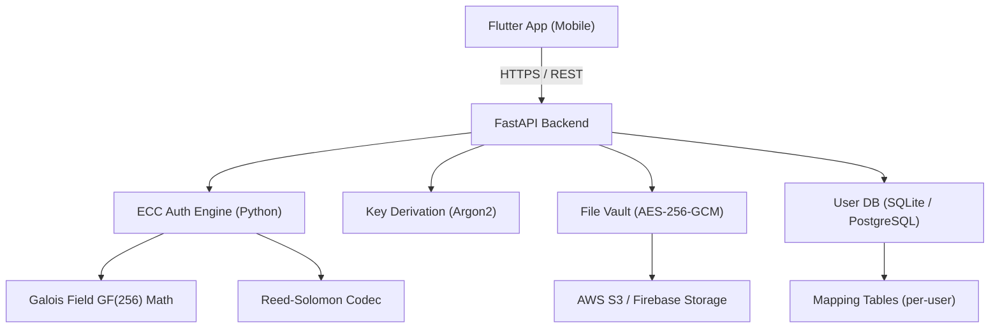

# SecureCorrect — Fault-Tolerant Cloud Storage Platform

A secure cloud storage system that uses Reed-Solomon Error-Correcting Codes at the authentication layer to recover from minor password typos, without compromising cryptographic security.

---

## Architecture Overview



---

## Open Questions

> [!IMPORTANT]
> **Storage Backend**: AWS S3 or Firebase Storage? The backend code will differ. For this implementation, I'll use **Firebase Storage** (simpler setup, no AWS credentials needed to start), but will make it swappable via a storage abstraction layer.

> [!IMPORTANT]
> **ECC Correction Threshold**: The spec says "up to 2 character errors." With Reed-Solomon over GF(256), we need `2t` parity symbols for `t` error corrections. So:
> - **2 errors** → 4 parity symbols appended to the codeword
> - **4 erasures** (wildcards `*`) → also correctable with 4 parity symbols
> - Mixed: `e` errors + `r` erasures where `2e + r ≤ 4`
>
> The password length will thus be padded to a fixed length (e.g., 16 chars) before encoding. Should the max password length be **16 chars**?

> [!WARNING]
> **Security Model Clarification**: The ECC codeword (the mathematical encoding of the password) must **never** be stored on the server. What is stored is only the **HMAC of the derived key**, which serves as the integrity guard. This ensures the server cannot brute-force the password. Confirm this is the intended design.

> [!NOTE]
> **Phase Scope for this Implementation**: I'll build all three phases fully — Phase 1 (math core), Phase 2 (FastAPI backend), and Phase 3 (Flutter UI). The Flutter app will be a functional prototype targeting Android/iOS.

---

## Proposed Changes

### Phase 1 — The Math Core

**Location**: `c:\Users\yusef\Desktop\project\backend\ecc\`

#### [NEW] `galois_field.py`
Pure Python implementation of GF(256) arithmetic:
- `GF256` class with `add`, `mul`, `div`, `pow` operations
- Uses the standard GF(2⁸) primitive polynomial `x⁸ + x⁴ + x³ + x² + 1` (0x11D)
- Precomputed log/antilog tables for O(1) multiplication

#### [NEW] `reed_solomon.py`
Reed-Solomon codec built on top of `galois_field.py`:
- `encode(message: list[int], n_parity: int) -> list[int]`: appends parity symbols
- `decode(codeword: list[int], erasure_positions: list[int]) -> list[int]`: syndrome-based decoder with Berlekamp-Massey / Forney algorithm
- Handles both **errors** (unknown position) and **erasures** (known position from `*` wildcards)

#### [NEW] `mapping_engine.py`
User-specific character → GF(256) symbol mapping:
- `generate_mapping(user_id: str, seed: bytes) -> dict`: creates a bijective map from printable ASCII → GF(256) value using a CSPRNG seeded per-user
- `encode_password(password: str, mapping: dict) -> list[int]`
- `decode_symbols(symbols: list[int], mapping: dict) -> str`
- Prevents Rainbow Table attacks since each user's symbol space is shuffled differently

#### [NEW] `ecc_auth.py`
Top-level authentication logic:
- `register_password(password: str, user_id: str) -> (codeword: list[int], mapping: dict)`: encodes password into an RS codeword
- `verify_and_correct(input_password: str, stored_codeword: list[int], mapping: dict, erasure_chars: str = "*") -> (corrected_password: str | None, success: bool)`: attempts correction, returns corrected plaintext or `None` on failure

---

### Phase 2 — The FastAPI Backend

**Location**: `c:\Users\yusef\Desktop\project\backend\`

#### [NEW] `main.py`
FastAPI application entry point with CORS, lifespan, and router registration.

#### [NEW] `models.py`
SQLAlchemy ORM models:
- `User`: `id`, `username`, `argon2_hash` (of corrected password), `mapping_table` (JSON blob, encrypted at rest), `ecc_codeword` (the RS-encoded symbols), `hmac_key`
- `File`: `id`, `user_id`, `filename`, `s3_key`, `iv` (GCM nonce), `hmac_tag`, `created_at`

#### [NEW] `schemas.py`
Pydantic v2 request/response models for all endpoints.

#### [NEW] `routers/auth.py`
Authentication endpoints:
- `POST /auth/register` — creates user, generates mapping, encodes password, stores codeword + Argon2 hash
- `POST /auth/login` — accepts `{username, password, erasures}`, runs ECC correction, derives key, returns JWT
- `GET /auth/me` — returns current user info (JWT protected)

#### [NEW] `routers/files.py`
File vault endpoints:
- `POST /files/upload` — accepts file + JWT, encrypts with AES-256-GCM using derived key, uploads to Firebase/S3, stores HMAC tag
- `GET /files/list` — lists user's files (metadata only)
- `GET /files/download/{file_id}` — decrypts file in-memory (secure buffer), streams to client
- `DELETE /files/{file_id}` — removes file from storage and DB

#### [NEW] `security.py`
Crypto utilities:
- `derive_key(password: str, salt: bytes) -> bytes` — Argon2id key derivation
- `encrypt_file(data: bytes, key: bytes) -> (ciphertext: bytes, iv: bytes, tag: bytes)` — AES-256-GCM
- `decrypt_file(ciphertext: bytes, key: bytes, iv: bytes, tag: bytes) -> bytes`
- `generate_hmac(data: bytes, key: bytes) -> bytes`
- `verify_hmac(data: bytes, key: bytes, expected: bytes) -> bool`

#### [NEW] `database.py`
SQLAlchemy async engine setup (SQLite for dev, PostgreSQL for prod).

#### [NEW] `requirements.txt`
```
fastapi
uvicorn[standard]
sqlalchemy[asyncio]
aiosqlite
python-jose[cryptography]
passlib[argon2]
pycryptodome
firebase-admin
pydantic[email]
python-multipart
```

#### [NEW] `Dockerfile`
Containerized backend for deployment.

---

### Phase 3 — The Flutter Frontend

**Location**: `c:\Users\yusef\Desktop\project\frontend\`

#### App Structure
```
lib/
├── main.dart
├── app.dart                    # MaterialApp, theme, routing
├── core/
│   ├── api_client.dart         # Dio HTTP client with JWT interceptor
│   ├── secure_storage.dart     # flutter_secure_storage wrapper
│   └── models/
│       ├── user.dart
│       └── file_item.dart
├── features/
│   ├── auth/
│   │   ├── login_screen.dart   # Error-aware login with * wildcard support
│   │   ├── register_screen.dart
│   │   └── auth_bloc.dart      # BLoC state management
│   └── vault/
│       ├── vault_screen.dart   # File list, upload/download
│       ├── file_card.dart
│       └── vault_bloc.dart
└── widgets/
    ├── ecc_password_field.dart  # Custom field: * key for erasures, char counters
    └── gradient_button.dart
```

#### Key UI Features
- **ECC Password Field**: Custom `TextField` with a `*` shortcut key on the keyboard action bar. Each `*` highlights as an "erasure slot" in a distinct color. Shows live "correction budget" counter (e.g., `✦ 2 errors OR 4 wildcards remaining`).
- **Vault Screen**: Card-based file list with upload FAB, download/delete swipe actions, file type icons, encrypted badge.
- **Design**: Dark glassmorphism theme — deep navy/midnight background, electric blue + violet accents, frosted glass cards.

#### [NEW] `pubspec.yaml`
```yaml
dependencies:
  flutter_bloc: ^8.x
  dio: ^5.x
  flutter_secure_storage: ^9.x
  file_picker: ^8.x
  open_filex: ^4.x
  lottie: ^3.x          # animations
  glassmorphism: ^3.x
```

---

## Security Properties Summary

| Property | Mechanism |
|---|---|
| Password never stored in plaintext | Argon2id hash + ECC codeword (not reversible to password) |
| ECC codeword doesn't leak password | Codeword is over user-specific symbol space; brute force requires knowing mapping |
| Mapping table confidentiality | Mapping stored encrypted (AES-256) using a server-side master key |
| False-positive correction rejected | HMAC tag on derived key; wrong correction → key mismatch → access denied |
| File confidentiality | AES-256-GCM with per-file IV; only decrypted locally or in ephemeral server memory |
| Rainbow table resistance | Per-user randomized Galois Field mapping |
| Token security | Short-lived JWTs (15 min) + refresh token rotation |

---

## Verification Plan

### Automated Tests
- `pytest backend/tests/` — Unit tests for GF(256) arithmetic, RS encode/decode round-trips, error/erasure correction
- Test vectors: known RS codes from textbook examples to validate math
- API integration tests: register → login (correct) → login (1 typo) → login (1 erasure) → upload → download → delete

### Manual Verification
- Flutter app: test login with 1 typo, login with `*` wildcard, wrong password (> threshold) is rejected
- Confirm HMAC guard: manually craft a "corrected" password that doesn't match → access denied
- File round-trip: upload a file, download it, verify byte-for-byte equality

---

## Project File Tree (Final)

```
c:\Users\yusef\Desktop\project\
├── backend/
│   ├── ecc/
│   │   ├── galois_field.py
│   │   ├── reed_solomon.py
│   │   ├── mapping_engine.py
│   │   └── ecc_auth.py
│   ├── routers/
│   │   ├── auth.py
│   │   └── files.py
│   ├── main.py
│   ├── models.py
│   ├── schemas.py
│   ├── security.py
│   ├── database.py
│   ├── requirements.txt
│   └── Dockerfile
├── frontend/
│   ├── lib/
│   │   ├── main.dart
│   │   ├── app.dart
│   │   ├── core/...
│   │   ├── features/...
│   │   └── widgets/...
│   └── pubspec.yaml
└── README.md
```
